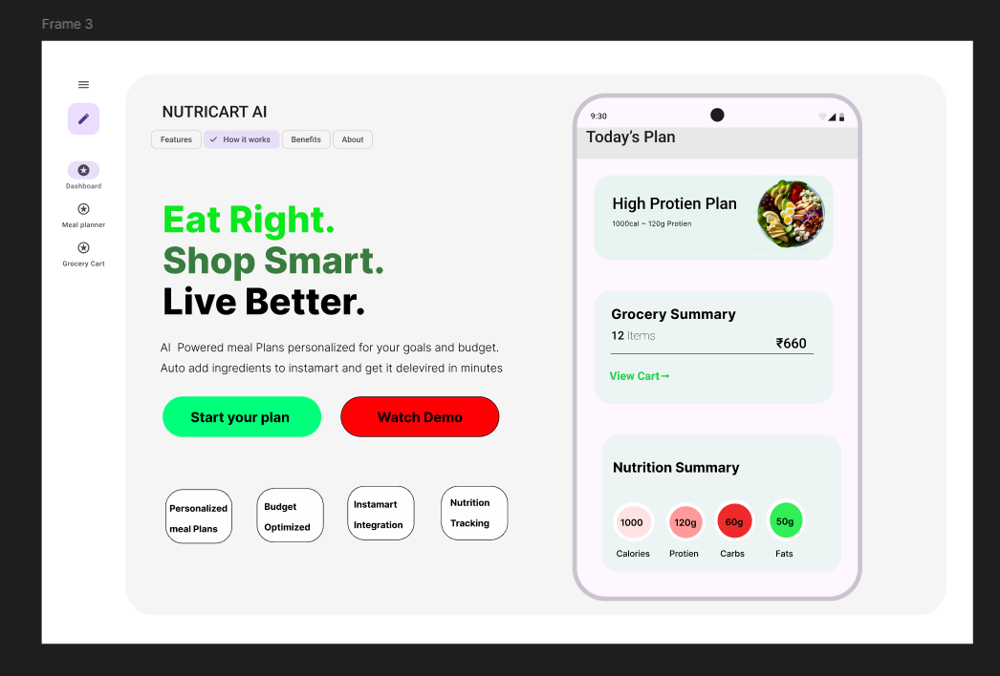

# NutriCart-AI
AI-powered nutrition and grocery automation platform integrated with Swiggy Instamart.

## Overview
NutriCart AI is an AI-powered nutrition and grocery automation platform integrated with Swiggy Instamart. The platform helps users generate personalized meal plans based on fitness goals, budget, and dietary preferences while automatically optimizing grocery purchases.

---

## Problem Statement
Many students, bachelors, and fitness-focused users struggle with:
- Healthy eating
- Grocery planning
- Budget optimization
- Meal consistency
- Nutrition tracking

NutriCart AI simplifies nutrition and grocery decisions using AI-driven recommendations and automation.

---

## Key Features
- AI meal planning
- Budget-based nutrition optimization
- Smart grocery cart generation
- Instamart integration
- Nutrition analytics dashboard
- Beginner-friendly cooking assistance

---

## How It Works
1. User enters fitness goal and budget
2. AI generates personalized meal plan
3. System calculates calories and protein
4. Grocery items are optimized using Instamart availability
5. Smart grocery cart is generated automatically

---

## Tech Stack
- Python
- Streamlit
- OpenAI APIs
- PostgreSQL / Supabase
- MCP Integration APIs

---

## Architecture Overview
User → NutriCart AI → AI Recommendation Engine → Grocery Optimization → Instamart Cart Generation

---

## Current Status
- MVP UI prototype completed
- AI workflow planning in progress
- MCP integration architecture under development

---

## UI Prototype

## Figma Prototype
https://www.figma.com/design/Ld2u7b6hfJILyFcGFCbyV2/Untitled?node-id=0-1&t=BFhaMzrbCxsNb0bv-1
Still in progress working on that
---

## Future Scope
- Voice-based AI nutrition assistant
- Pantry management
- Personalized grocery recommendations
- Health analytics
- Smart cooking assistant

---

## Author
Vivek B
